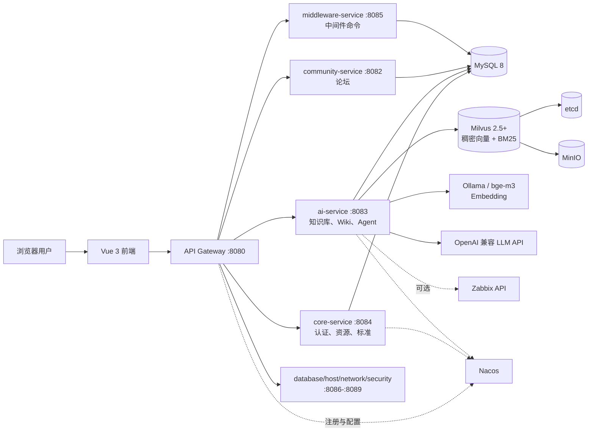
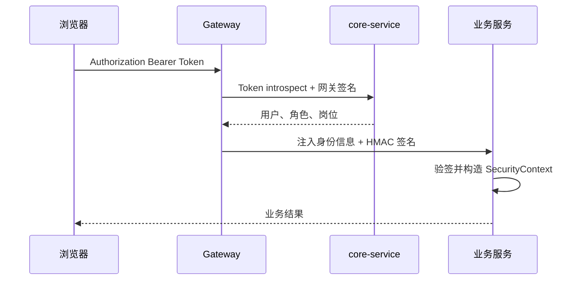
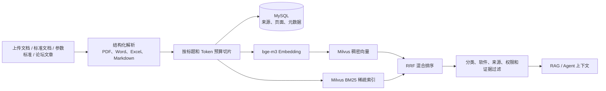

# 集成中心门户系统交接与能力说明

> 面向系统使用者、运维同事和后续开发维护人员。本文描述截至 2026-08-04 当前分支已经实现并完成现网验证的能力；规划中的能力会单独标记，不作为当前承诺。

## 1. 系统定位

集成中心门户面向基础设施和运维团队，将分散的软件资源、参数标准、运维文档、知识经验和故障排查能力集中到一个统一入口。系统覆盖中间件、数据库、主机、网络、网络安全等岗位，主要解决以下问题：

- 软件安装包、版本说明和下载地址分散，缺少统一维护入口。
- 参数标准和运维手册缺少版本、审核、发布和可追溯能力。
- PDF、Word、Excel、Markdown 等资料难以统一检索和复用。
- 故障排查依赖个人经验，知识检索、监控数据和处理步骤没有形成闭环。
- 多岗位系统入口、账号权限和审计规则不统一。

系统不是自动执行生产变更的平台。当前智能排查以知识检索、辅助分析和只读工具为主，涉及真实变更的操作仍需人工确认并在受控平台执行。

## 2. 用户可以使用的功能

| 模块 | 主要能力 | 适用人员 |
| --- | --- | --- |
| 首页 | 汇总岗位入口、资源、标准、迁移和交流能力 | 全部已登录用户 |
| 下载中心 | 查看版本、平台、发布说明，下载软件安装包 | 全部已登录用户 |
| 标准发布 | 浏览已发布参数标准和标准文档，按软件分类查看 | 全部已登录用户 |
| 论坛 | 发帖、评论、点赞、标签检索和个人内容管理 | 全部已登录用户 |
| 知识库 | 文档导入、混合检索、经验页面、知识图谱、健康度检查 | 已授权用户；管理操作受角色限制 |
| 智能排查 | RAG 知识问答、Agent 排查、会话历史、引用展示、Skill 管理 | 已授权用户；Skill 管理限管理员 |
| 管理后台 | 软件类型、版本资源、标准、文档、账号、角色和模块开关 | 对应岗位管理员、系统管理员 |
| 中间件岗位 | 常用命令查询以及按名称导入、导出 | 中间件岗位及管理员 |
| 数据库岗位 | 数据迁移能力设计入口 | 数据库岗位及管理员 |
| 主机、网络、安全岗位 | 已具备独立服务和页面骨架，后续可增量建设岗位能力 | 对应岗位用户 |

### 2.1 资源与标准管理

- 软件类型、版本、平台、发布日期、发布状态和版本说明统一维护。
- 安装包上传后保存文件元数据，公开页面提供稳定下载入口并统计下载次数。
- 参数标准支持草稿、提交审核、审批通过或驳回、发布和修改流程。
- 审核时可以比较参数值差异，发布内容带标准版本和发布时间。
- 标准文档可以关联参数标准，并通过 `{{参数名}}` 占位符引用参数值。

### 2.2 论坛与经验交流

- 支持文章列表、详情、发布、编辑、评论、点赞、标签和个人中心。
- 已发布论坛文章可以选择性导入知识库，进入统一检索范围。
- 论坛内容与参数标准一样保留业务系统作为事实源，知识库保存可检索副本。

## 3. 总体架构

系统采用前后端分离和微服务部署。外部请求统一进入 Gateway，业务服务在 `cloud` profile 下通过 Nacos 注册和读取配置。

### 3.1 服务职责

| 服务 | 端口 | 当前职责 |
| --- | ---: | --- |
| `api-gateway` | 8080 | 唯一业务入口、Bearer Token 校验、精确路由、身份头签名 |
| `community-service` | 8082 | 论坛文章、评论、点赞和标签 |
| `ai-service` | 8083 | 知识库、Wiki、RAG 问答、Ops Agent、Zabbix 工具 |
| `core-service` | 8084 | 登录、账号角色、资源目录、下载、参数标准和标准文档 |
| `middleware-service` | 8085 | 中间件常用命令和迁移接口 |
| `database-service` | 8086 | 数据库岗位独立服务骨架，当前主要提供健康检查 |
| `host-service` | 8087 | 主机岗位独立服务骨架，当前主要提供健康检查 |
| `network-service` | 8088 | 网络岗位独立服务骨架，当前主要提供健康检查 |
| `security-service` | 8089 | 网络安全岗位独立服务骨架，当前主要提供健康检查 |

### 3.2 认证与权限

- 客户端不能直接伪造用户身份头，Gateway 会先清理再重新签名。
- 所有业务服务必须共享同一个 `GATEWAY_SIGNING_SECRET`，长度至少 32 字节。
- 普通用户只能访问自己的智能排查会话；管理员可以查看全部会话。
- Wiki 页面支持按页面设置访问权限，RAG 检索会传递当前用户身份。
- 密钥只通过环境变量注入，不写入 Git 或 Nacos。

## 4. 关键技术方案

### 4.1 配置与部署

- `deploy/compose.env`：端口、镜像版本、数据目录和基础组件配置。
- `deploy/services.env`：数据库密码、网关签名、LLM、Embedding、Zabbix 等业务密钥与运行参数。
- `deploy/nacos-config/*.properties`：非敏感业务配置模板；`nacos-init` 在依赖部署时发布或更新 Data ID。
- Nacos 中的 `${AI_API_KEY:}`、`${AI_BASE_URL:...}` 等写法由 Spring 在业务容器启动时解析为环境变量。
- CI 使用不可变镜像标签，将运行清单持久化到 `/app/infra-portal/deploy`，支持按服务增量部署。

生产环境的 `DEPLOY_COMPOSE_ENV_FILE` 和 `DEPLOY_SERVICES_ENV_FILE` 是最终配置源。直接修改服务器文件只能解决当前运行实例，下次流水线部署仍会以 CI/CD File 变量覆盖服务器文件。

### 4.2 知识库处理链路

技术要点：

- Word、Excel 和 PDF 尽量保留标题、段落和表格结构；解析失败时降级到 Tika 文本提取。
- Markdown 原样保留标题层级，下游切片器按结构切分。
- Milvus 使用稠密语义向量与 BM25 稀疏向量双路检索，再用 RRF 融合。
- BM25 用于补足参数名、错误码和配置项等精确 Token 的召回。
- 检索支持分类、软件、来源类型和来源 ID 过滤。
- 参数标准类问题提供数据库精确查询接口，返回值、范围、标准版本和发布时间，不依赖模型猜测。
- RAG 入口过滤明显无关证据，出口检查答案中新出现但没有来源的技术标识，降低幻觉风险。

### 4.3 智能排查的两种模式

| 模式 | 请求入口 | 工作方式 | 适合场景 |
| --- | --- | --- | --- |
| RAG 模式 | `/api/agent/chat` | 并行检索 Wiki 和向量知识库，筛选证据后调用 LLM，流式返回答案和引用 | 标准查询、配置说明、知识问答、一般故障咨询 |
| Agent 模式 | `/api/ops-agent/chat` | 匹配 YAML Skill，执行知识库或外部工具步骤，再由 LLM 综合分析 | 有固定排查流程、需要监控数据或可复用排查步骤的场景 |

两种模式共用会话列表和消息历史，可以在同一页面切换。前端通过 SSE 展示重试、步骤开始、工具结果、增量回答、最终结果和完成状态，用户可以主动停止当前请求。

## 5. 知识库当前能力与效果

### 5.1 已实现能力

- 上传并解析 `.pdf`、`.doc`、`.docx`、`.xls`、`.xlsx`、`.md`。
- 同步已发布参数标准，并导入标准文档和论坛文章。
- 按文档查看来源、分类、软件、切片内容和原文件。
- 删除知识来源时同步清理向量索引。
- 创建、编辑、搜索、删除、导入和导出经验页面。
- 从现有文档内容辅助起草经验页面，并支持重新关联内部链接。
- 展示知识图谱和页面间链接。
- 运行 Lint，发现断链、孤立页面、重复标题、过期内容等问题并标记处理。
- 查看知识来源、页面、索引切片、空内容、重复内容和未索引来源的健康度。

### 5.2 现网验证基线

以下数据来自 2026-08-04 对当前环境的只读验证：

| 指标 | 当前值 |
| --- | ---: |
| 知识来源 | 63 |
| 索引切片 | 1421 |
| `STANDARD_DOC` 来源 | 14 |
| `STANDARD_DOCUMENT` 来源 | 39 |
| `UPLOAD` 来源 | 10 |
| 空来源 | 0 |
| 重复内容组 | 0 |
| 未索引来源 | 0 |
| 索引状态 | 可靠 |

代表性查询 `proxy_buffer` 返回 5 条结果，命中了上传的 `nginx.xlsx`、中间件配置参数设置标准，以及版本化的 Nginx 参数配置标准。检索结果同时包含来源、来源类型、章节路径和相关度，可供页面展示和 RAG 引用。

当前知识来源数据完整且已全部进入索引，但结构化经验页面数量为 0，因此“经验沉淀”和知识图谱页面目前主要展示功能框架。随着经验页面录入，图谱、链接和 Lint 的业务价值会逐步体现。

## 6. 智能排查当前能力与效果

### 6.1 RAG 问答

当前环境已使用下列组合完成端到端验证：

- 对话模型：`gpt-5.6-sol`，OpenAI 兼容接口地址必须包含 `/v1`。
- Embedding：Mac 上的 Ollama `bge-m3`。
- 向量检索：Milvus 稠密向量 + BM25 + RRF。
- 统一入口：`192.168.126.1:18080` Gateway。

使用问题“当前 Nginx 标准中 proxy_buffer 相关的配置值是多少”进行验证时：

- Gateway 返回 HTTP 200。
- 15.3 秒内完成流式回答。
- 收到 525 个增量片段、1 个最终结果事件和 1 个完成事件。
- 回答列出了 `proxy_buffer_size`、`proxy_buffers`、`proxy_busy_buffers_size` 等配置，并带知识来源。
- AI 服务最近日志无认证失败、非 SSE 响应、JSON 解析错误或模型超时。

这说明当前链路已经能够完成“用户提问 -> 知识检索 -> 证据筛选 -> LLM 流式回答 -> 引用展示 -> 会话保存”。回答质量仍取决于知识库内容质量、检索命中和外部模型服务可用性。

### 6.2 Agent 与工具现状

| 工具 | 当前状态 | 说明 |
| --- | --- | --- |
| `knowledge_search` | 可用 | 自动混合检索 Wiki 和向量知识库，支持分类、软件和来源过滤 |
| `zabbix_query` | 代码已实现，依赖外部配置 | 查询指定主机、指标和时间范围的 Zabbix 历史数据 |
| `zabbix_export` | 代码已实现，依赖外部配置 | 将 Zabbix 数据导出为 Excel |
| `save_experience` | 可用 | 将排查步骤保存为可复用 Skill |
| `search_logs` | 尚未接入 | 当前只返回“待接入 Elasticsearch/Loki”，不能作为真实日志证据 |
| `query_metrics` | 尚未接入 | 当前只返回“待接入 Prometheus”，不能作为真实监控证据 |
| 命令执行 | 未实现 | 当前没有直接执行生产命令的 Tool，不应对外宣称支持自动处置 |

系统内置连接池、CPU 高、磁盘、OOM、Redis 和 Zabbix 等 YAML Skill。Agent 会按关键词匹配 Skill，逐步执行工具或提示步骤，并记录工具名称、耗时、成功状态和摘要。管理员可在页面新增、编辑、删除 Skill，也可把一次有效回答保存为新的排查经验。

### 6.3 当前边界

- RAG 模式可以基于内部资料回答，也会在没有内部证据时使用通用模型知识并明确说明。
- Agent 模式不是完全自治系统；工具没有返回证据时，结论仍需人工核实。
- Zabbix 只有在地址、账号和密码正确且目标主机、指标存在时才可用。
- 日志和 Prometheus 工具目前是占位实现，不能写入验收范围。
- 未接入 CMDB，用户需要在问题中明确系统、主机、软件版本和现象。
- 没有自动执行变更命令、审批、回滚或生产操作审计闭环。

## 7. 当前部署环境说明

| 组件 | 当前配置 |
| --- | --- |
| 业务入口 | `http://192.168.126.1:18080` |
| Nacos | `http://192.168.126.1:18848/nacos/`，监听局域网 |
| LLM Base URL | `http://ai.tlb.shcj-s.com:8080/v1` |
| LLM Model | `gpt-5.6-sol` |
| Embedding Base URL | `http://192.168.26.251:11434/v1` |
| Embedding Model | `bge-m3` |

注意事项：

- `AI_API_KEY`、数据库密码、网关签名和 Nacos 凭据禁止写入本文或 Git。
- Mac 地址 `192.168.26.251` 是当前 Ollama 依赖地址。Mac 关机、休眠、切换网络或地址变化会影响导入和检索。
- `192.168.126.1` 到 Mac 跨网段连接曾观察到 TCP 首次建连重传，可能增加 Embedding 延迟；该问题位于网络路径，不是 Ollama 推理性能本身。
- Nacos 暴露到局域网后必须修改默认账号密码，并通过防火墙限制可访问网段。
- LLM 当前使用 HTTP 地址，API Key 会以明文传输；生产环境应改为 HTTPS 或通过可信内网代理访问。

## 8. 新同事建议使用流程

1. 使用个人账号登录，不共享系统管理员账号。
2. 先在“标准发布”确认已有参数标准和版本，再使用知识库检索。
3. 在“知识库 -> 检索”输入产品名、版本和具体参数，例如 `Nginx proxy_buffer_size`。
4. 参数值类问题优先核对返回的标准版本和发布时间。
5. 在“智能排查”先使用 RAG 模式确认知识依据；需要固定流程时再切换 Agent 模式。
6. 查看回答下方引用，打开原文核对关键命令、参数和适用版本。
7. 有价值的排查过程由管理员整理为经验页面或 Skill，避免直接保存未经验证的模型输出。
8. 执行生产操作前，由业务负责人确认影响范围、变更窗口和回滚方案。

## 9. 运维检查清单

出现页面可访问但功能异常时，按以下顺序检查：

1. Gateway 是否可访问，登录和受保护接口是否返回 200。
2. `core-service` 是否健康，Token introspect 是否正常。
3. `ai-service` 是否健康，运行时是否存在 `AI_BASE_URL`、`AI_MODEL` 和 `AI_API_KEY`。
4. LLM Base URL 是否包含 `/v1`；缺少 `/v1` 时可能返回 HTML 而不是 OpenAI JSON/SSE。
5. Ollama 是否监听 `0.0.0.0:11434`，`bge-m3` 是否已加载。
6. Milvus 是否为 2.5 或更高版本，collection 是否包含稠密、文本和稀疏字段。
7. Nacos 的 `ai-service.properties` 是否存在，业务容器能否访问 `nacos:8848`。
8. 检查 AI 日志中是否出现 401、超时、非 SSE Content-Type 或向量检索错误。

常用健康端口：

| 组件 | 检查地址 |
| --- | --- |
| Gateway | `http://127.0.0.1:18080/` |
| ai-service | 宿主机 `127.0.0.1:8083` 或容器内 `localhost:8083` |
| core-service | 宿主机 `127.0.0.1:8084` 或容器内 `localhost:8084` |
| Nacos | `http://127.0.0.1:18848/nacos/actuator/health` |
| Ollama | `http://192.168.26.251:11434/api/version` |

## 10. 更新与配置变更规则

- 普通 `docker compose restart` 会保留当前环境文件。
- GitLab 业务部署会用 `DEPLOY_SERVICES_ENV_FILE` 覆盖服务器的 `services.env`。
- 依赖部署和全栈部署会重新构建 `nacos-init` 并发布仓库中的 Nacos 模板。
- 修改 LLM 地址、模型或 Key 后必须重建或重启 `ai-service`，并做一次真实 SSE 问答验证。
- 修改 Embedding 模型或维度后不能只重启服务，需要确认 Milvus collection schema 和已有向量是否兼容，必要时重建索引。
- Mac 上 Codex 的 `auth.json` 与服务器环境变量没有自动同步关系；Key 轮换时必须同步更新 CI/CD 变量。

## 11. 相关文档

- [README](../README.md)
- [后端微服务全景](microservices-overview.md)
- [生产部署说明](production-deploy.md)
- [启动手册](startup-manual.md)
- [知识库环境验证清单](knowledge-base-verification.md)
- [本地 RAG 配置](local-rag-setup.md)
- [Zabbix 集成指南](zabbix-integration-guide.md)

